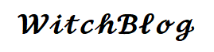

<!-- PROJECT LOGO -->
 

  

  <h3 align="center">WitchBlog</h3>

  

    Blog about magic and divination
     
    <a href="https://github.com/witch-blog-pwr/witch-blog-pwr_backend">View Demo</a>
    ·
    <a href="https://github.com/witch-blog-pwr/witch-blog-pwr_backend/issues">Report Bug</a>
    ·
    <a href="https://github.com/witch-blog-pwr/witch-blog-pwr_backend/issues">Request Feature</a>
  

<!-- TABLE OF CONTENTS -->

  
Table of Contents

  <ol>
    <li>
      <a href="#about-the-project">About The Project</a>
      <ul>
        <li><a href="#built-with">Built With</a></li>
      </ul>
    </li>
    <li><a href="#installation">Installation</a></li>
    <li><a href="#usage">Usage</a></li>
    <li><a href="#contributing">Contributing</a></li>
    <li><a href="#license">License</a></li>
    <li><a href="#contact">Contact</a></li>
  </ol>

<!-- ABOUT THE PROJECT -->
## About The Project

<!-- [![Product Name Screen Shot][product-screenshot]](https://example.com) placeholder for future -->

We are a group of students of Cybersecurity in Wroclaw University of Science and technology. During our studies we have team project,
which try to teach us how to work as a team to achive and fulfill goals. Our task is to create a blog about witchcraft and mobile
application, which could use camera to scan tarror cards, detect them and on produce divination as output.

(<a href="#readme-top">back to top</a>)

### Built With

List of used technologies:
 1. Java
 2. JavaScript
 3. Html/Css
 4. Angular
 5. Spring

(<a href="#readme-top">back to top</a>)

### Installation

To install this blog:

Just a placeholder for now.

(<a href="#readme-top">back to top</a>)

<!-- USAGE EXAMPLES -->
## Usage

Just a placeholder for now

(<a href="#readme-top">back to top</a>)

<!-- CONTRIBUTING -->
## Contributing

Because of university regulations we have to work on our own and nobody can contribute in this project. Howevery, we will be glad for all reported bugs and requested changes.

(<a href="#readme-top">back to top</a>)

<!-- LICENSE -->
## License

For now it's just a placeholder

(<a href="#readme-top">back to top</a>)

<!-- CONTACT -->
## Contact

WitchBlogTeam - witch.blog.pwr@gmail.com

Project Link: [https://github.com/witch-blog-pwr/witch-blog-pwr_backend](https://github.com/witch-blog-pwr/witch-blog-pwr_backend)

(<a href="#readme-top">back to top</a>)

